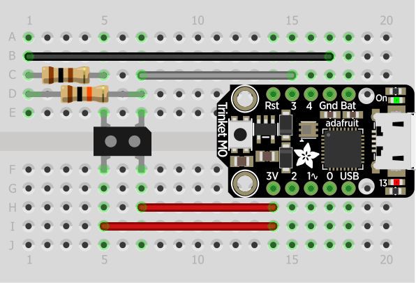
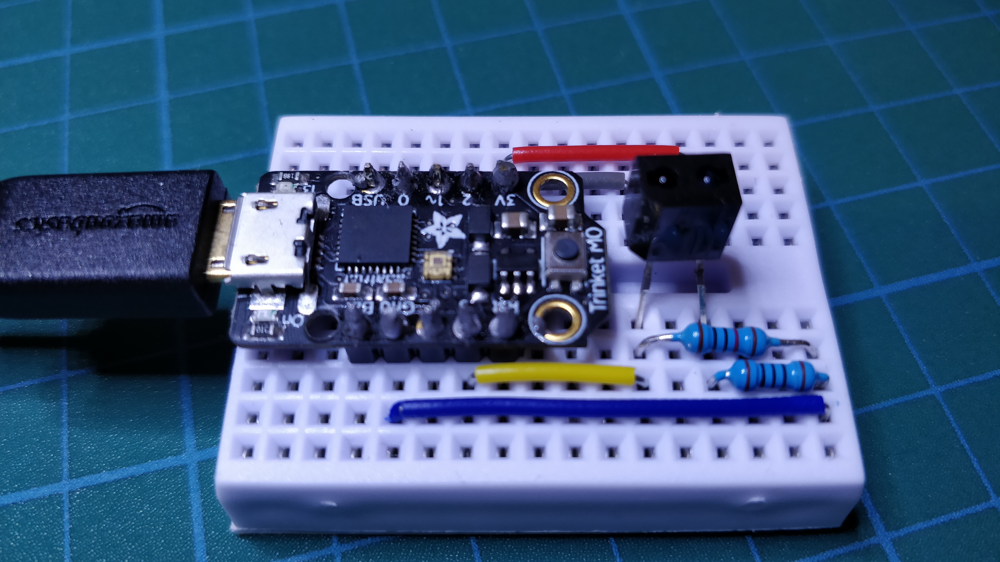

# R&D

## v 0.4

### 1. Montage





### 2. Composants

* Microcontrôleur Trinket M0
* Capteur RPR 220
* Résistances 100 et 10k

### 3. Programme

```python
import time
import board
import math
import digitalio
from analogio import AnalogIn

# LED de la carte
import adafruit_dotstar
led = adafruit_dotstar.DotStar(board.APA102_SCK, board.APA102_MOSI, 1)
#led.brightness = 0.01

# RPR 220
analog_in = AnalogIn(board.A3)


# Initialisations
n = 0
ref = analog_in.value
last_clock = 0
clock = 0
cycle = 0
Ti = 0
Tf = 0
cycles = 0
nb_periodes = 0
nb_periodes_total = 10

while nb_periodes <= nb_periodes_total:
    led[0] = (0, 0, 0)
    debut = 0
    fin = 0
    plot = ref
    while analog_in.value > ref*1.5:
        led[0] = (0, 255, 0)
        if debut == 0:
            debut = time.monotonic()
            #print((plot*2,))
            #print((analog_in.value),)
        print(analog_in.value)
    fin = time.monotonic()

    if debut != 0:
        
        if cycles % 2 == 0:
            nb_periodes = nb_periodes + 1
            #clock = debut + (fin-debut)/2
            clock = debut
            if Ti == 0:
                Ti = clock

            Tf = clock

        cycles = cycles + 1
        plot = plot*2

    led[0] = (0, 0, 0)

    #print((plot,))
    print(analog_in.value)
    time.sleep(0.02)

print('')
print('================================')
print('= Temps total :', Tf - Ti, 's')
print('= Nombre de periode :', nb_periodes_total)
print('= Periode :', (Tf - Ti) / nb_periodes_total,'s')
print('================================')
l = (((Tf - Ti) / nb_periodes_total)**2 * 9.81) / (4*math.pi**2)
print('Longueur du fil : ',l,'m')
```

## v 0.3



## v 0.2



## v 0.1



