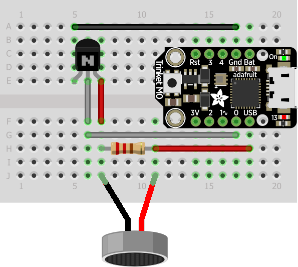
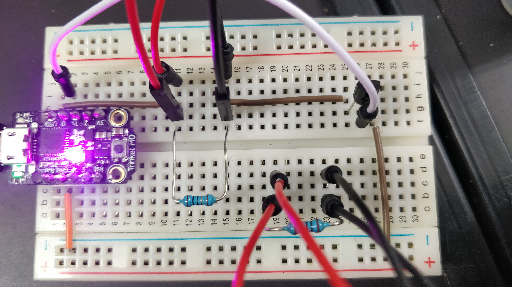
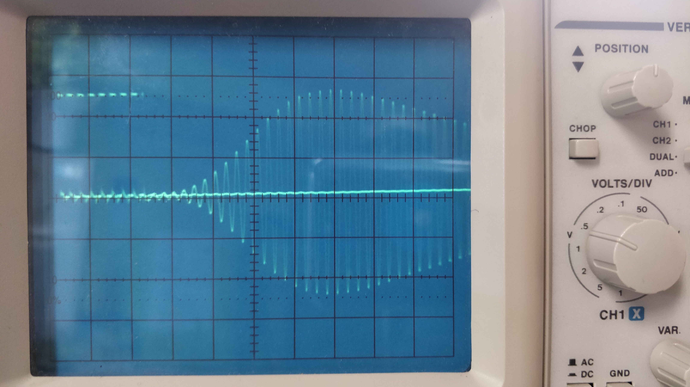
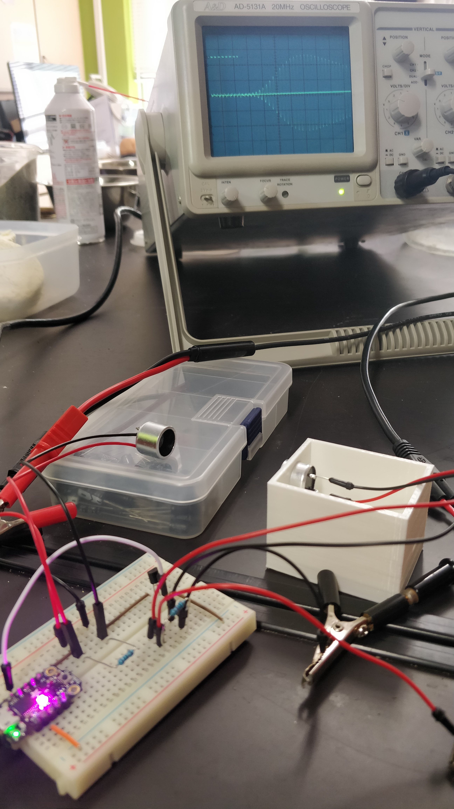

# R&D

## v 0.1

### 1. Montage









### 2. Composants

* Microcontrôleur Trinket M0
* Transistor NPN
* Résistance
* Emetteur / récepteur ultrasons

### 3. Programme

```python
import board
import pulseio
import array

pwm = pulseio.PWMOut(board.D0, frequency=40000, duty_cycle=2**15)
pulse = pulseio.PulseOut(pwm)
a = [200,10000]*1000
pulses = array.array('H', a)

while True:
    pulse.send(pulses)
```


